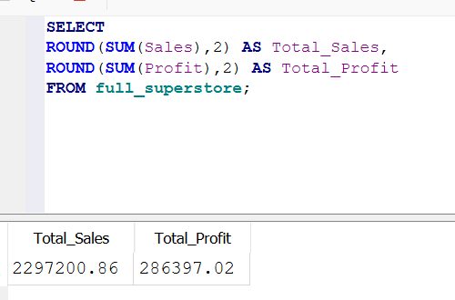
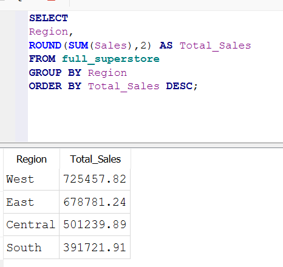
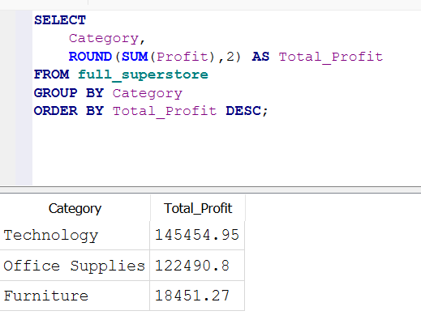
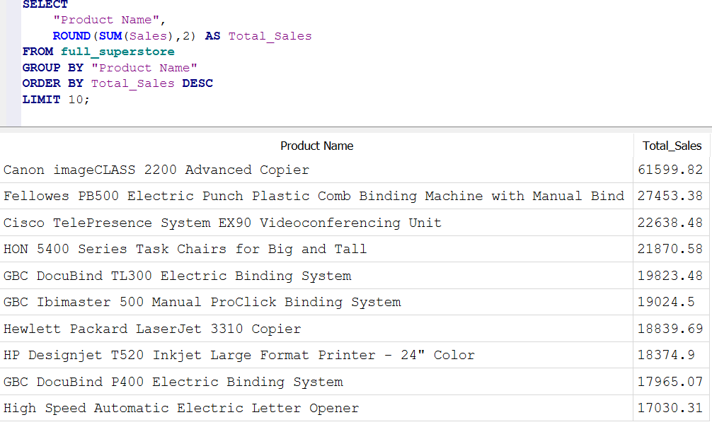

# SQL Business Insights Analysis

## Project Overview
Analyzed 9,994 retail transactions using SQL and SQLite to identify sales trends, profitability drivers, regional performance, and discount impact.

## Dataset
Superstore Retail Dataset

## Key Metrics
- Total Sales: $2,297,200.86
- Total Profit: $286,397.02

## Key Findings
- West region generated the highest sales and profit.
- Technology was the most profitable category.
- Canon imageCLASS 2200 Advanced Copier was the top-performing product.
- Discounts above 30% resulted in negative average profit.

## Skills Demonstrated
- SQL
- SQLite
- GROUP BY
- Aggregate Functions
- Business Analytics
- Data Analysis
- Data Visualization
- Business Intelligence 

## Project Screenshots

### Total Sales & Profit

### Sales by Region

### Profit by Category

### Top Product by Sales

## SQL Queries
See 'sql_queries.sql'
